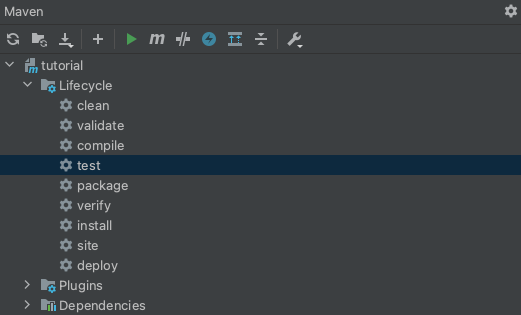
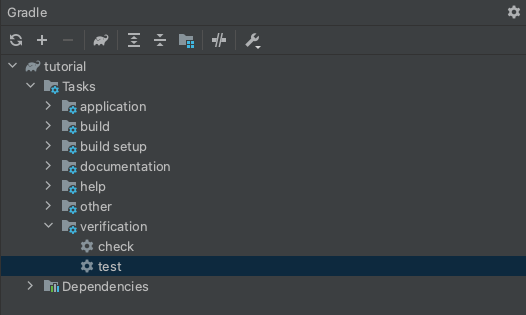
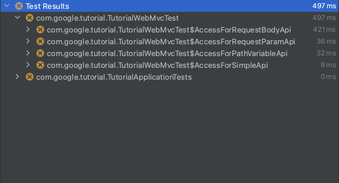
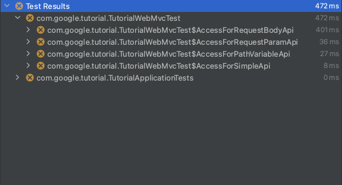

summary: Codelab Markdown Template
id: codelab-markdown-template
categories: spring,cloudrun
tags: cloudrun
status: Draft
authors: shinyay
Feedback Link: https://twitter.com/yanashin18618

# ラボのタイトル
<!-- ------------------------ -->
## はじめに 
Duration: 5

### 環境前提
次のソフトウェアをインストールしてください:

Positive
: [Cloud Shell](https://shell.cloud.google.com/) の場合は、以下インストール不要です。

- Java
- Docker ([https://www.docker.com](https://www.docker.com))
- Cloud SDK ([https://cloud.google.com/sdk](https://cloud.google.com/sdk))
  - [インストール方法](https://cloud.google.com/sdk/docs/install)
- IDE
  - IntelliJ IDEA
  - VS Code
  - NetBeans
  - Eclipse

このチュートリアルは、次のバージョンのソフトウェア環境で動作確認をしています:
- IDE: Intellij IDEA

```shell script
$ java --version
openjdk 11.0.10 2021-01-19
OpenJDK Runtime Environment AdoptOpenJDK (build 11.0.10+9)
OpenJDK 64-Bit Server VM AdoptOpenJDK (build 11.0.10+9, mixed mode)
```
```shell script
$ docker version
Client: Docker Engine - Community
 Cloud integration: 1.0.12
 Version:           20.10.5
 API version:       1.41
 Go version:        go1.13.15
 Git commit:        55c4c88
 Built:             Tue Mar  2 20:13:00 2021
 OS/Arch:           darwin/amd64
 Context:           default
 Experimental:      true

Server: Docker Engine - Community
 Engine:
  Version:          20.10.5
  API version:      1.41 (minimum version 1.12)
  Go version:       go1.13.15
  Git commit:       363e9a8
  Built:            Tue Mar  2 20:15:47 2021
  OS/Arch:          linux/amd64
  Experimental:     false
 containerd:
  Version:          1.4.4
  GitCommit:        05f951a3781f4f2c1911b05e61c160e9c30eaa8e
 runc:
  Version:          1.0.0-rc93
  GitCommit:        12644e614e25b05da6fd08a38ffa0cfe1903fdec
 docker-init:
  Version:          0.19.0
  GitCommit:        de40ad0
```
```shell script
$ gcloud version
Google Cloud SDK 337.0.0
alpha 2021.04.16
beta 2021.04.16
```

Positive
: 必ずしも同一バージョンである必要はありません。

<!-- ------------------------ -->
## このラボについて
Duration: 1

このラボでは、以下の内容を学習します。
- [Spring Boot](https://spring.io/projects/spring-boot) を用いたアプリケーション開発
- [Cloud Run](https://cloud.google.com/run) へのアプリケーションデプロイメント

### Spring Boot
このラボでは、値を返すだけのシンプルな REST API を提供するアプリケーションを作成します。

### Cloud Run
このラボでは、以下の内容を学習します。
- [Cloud Run のコンソール画面](https://console.cloud.google.com/run)からデプロイする方法
- [Cloud SDK](https://cloud.google.com/sdk) を用いたコマンドラインからデプロイする方法

Negative
: このラボでは、CI/CD パイプラインを用いた自動デプロイは対象外です。

<!-- ------------------------ -->
## Java プロジェクトの準備
Duration: 3

### チュートリアル プロジェクトの取得

次のファイルをダウンロードし、適当な場所へ配置および展開をしてください。

- tutorial.tar.gz

<button>
  [Download](tutorial.tar.gz)
</button>

### チュートリアル プロジェクトの IDE 表示

展開後に適当なIDEでプロジェクトを開いてください。
なお、ビルドツールとして [Maven](https://maven.apache.org/) および [Gradle](https://gradle.org/) が実施可能です。


<!-- ------------------------ -->
## Spring Boot チュートリアル 概要
Duration: 1

Spring Boot チュートリアルプロジェクトには、予めテストコードを配置しています。
このテストコードを実施して、その結果を見ながらメインコードの実装を行っていきます。

各 IDE 環境やビルドツールによって、テストの実行方法が異なります。このチュートリアルでは、以下の組み合わせで作成していますが、各自の環境に読み替えて実施してください。
- IDE: `InteliJ IDEA`
- ビルドツール: `Maven`

IntelliJ + Maven の場合



IntelliJ + Gradle の場合



Maven Wrapper の場合
```shell script
$ mvnw test
```

Gradle Wrapper の場合
```shell script
$ gradlew test
```

<!-- ------------------------ -->
## 最初のテスト実行
Duration: 2

それでは、最初にテストを実行してみます。
テストを実行すると、メインコードの実装がまだないため、以下のようにエラーがテスト結果に表示されます。



これらのエラー内容を確認して、正常終了するように修正を行いながらコードを完成させます。

<!-- ------------------------ -->
## テスト: アプリケーションコンテキスト
Duration: 3

- 対象テストクラス: ApplicationContextTests



### ヒント: `contextLoads`

以下のようにエラーが表示されています。
```shell script
Error creating bean with name 'com.google.tutorial.TutorialApplicationTests': Unsatisfied dependency expressed through field 'controller'; nested exception is org.springframework.beans.factory.NoSuchBeanDefinitionException: No qualifying bean of type 'com.google.tutorial.controller.TutorialController' available: expected at least 1 bean which qualifies as autowire candidate. Dependency annotations: {@org.springframework.beans.factory.annotation.Autowired(required=true)}
```

これは、`@Autowired` により **Dependency Injection** される対象が存在しないために発生しているエラーです。
インジェクションを行おうとしている対象のクラス `TutorialController` のクラス定義を確認してください。

<!-- ------------------------ -->
## テスト完了
Duration: 1


全てのテストが正常終了し、アプリケーションの実装要件を全て満たしました。


以上で、このラボは終了です。
